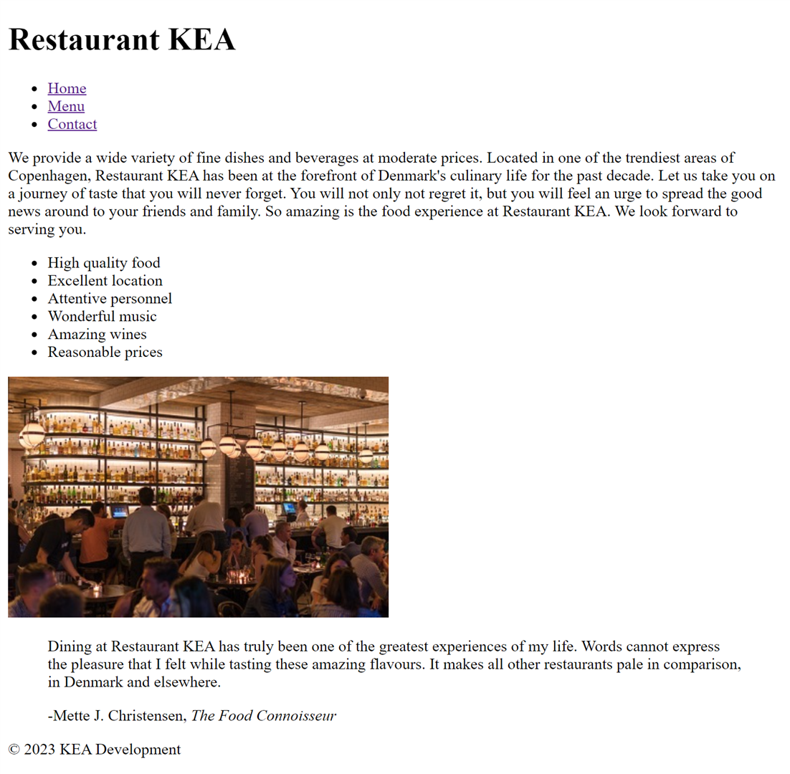
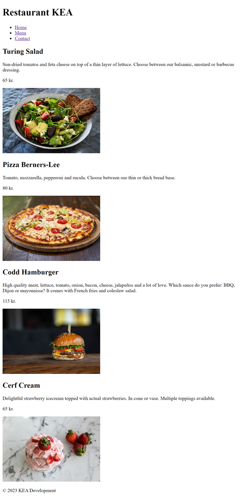
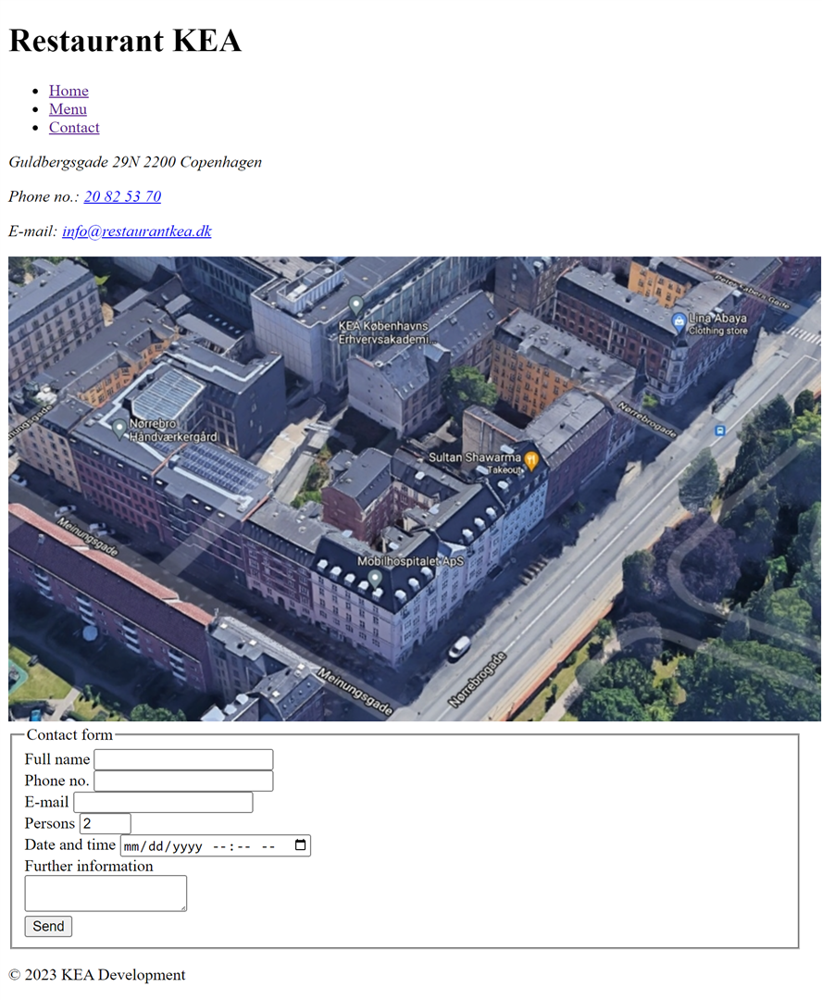

# KEA Restaurant
## First mandatory assignment

#### Write the HTML5 code for Restaurant KEA’s website so that it looks as in the pictures below. Create three pages (home page, food menu and contact). Focus on using semantic HTML.

#### Home page

#### Menu page

#### Contact page

